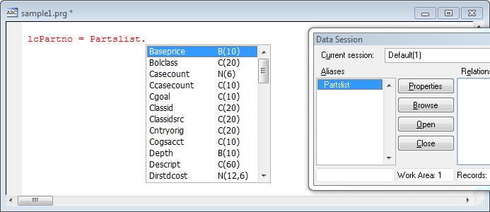
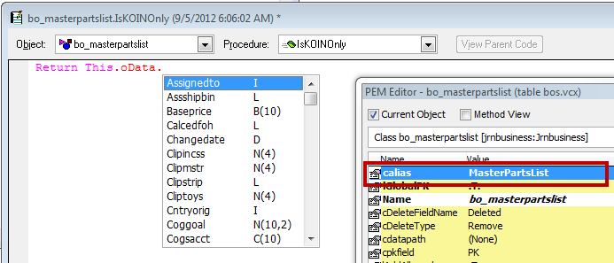
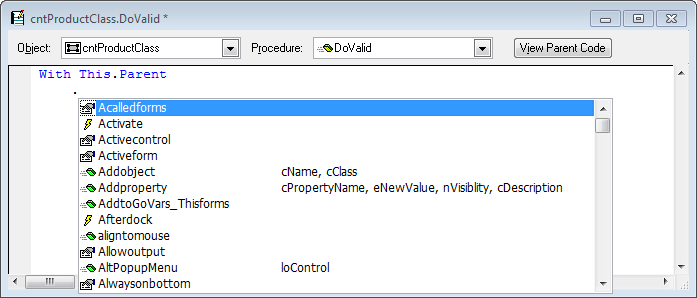
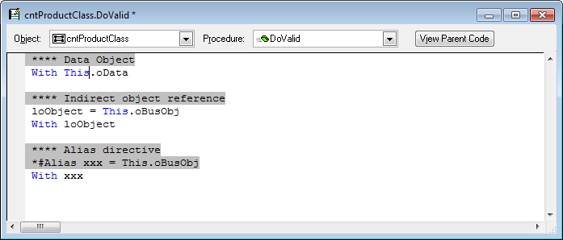
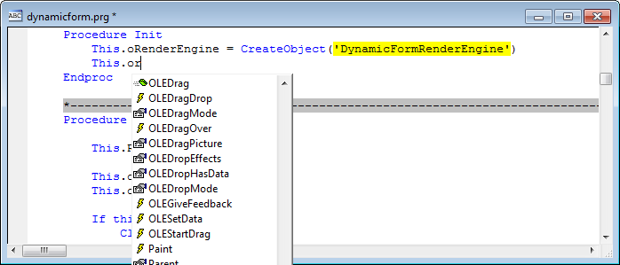
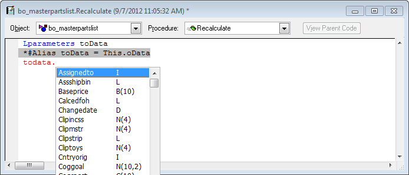
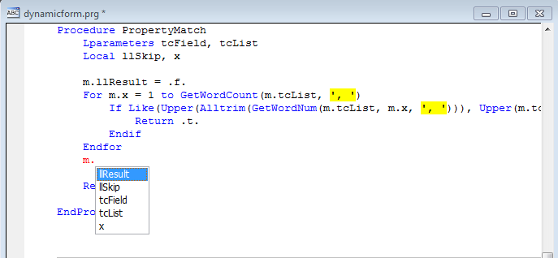
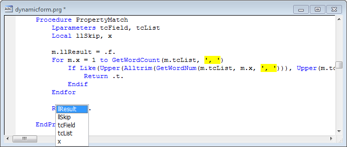
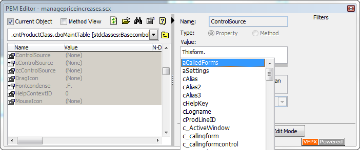

# Thor IntellisenseX

Version 1.24.03 Released 2023-03-14

[What's new in this release](Change%20Log.md)

*** 
[IntellisenseX White Paper](documents/IntellisenseX_WhitePaper.pdf)

[Videos](documents/Thor_IntellisenseX_Videos.md)

## Introduction
**IntellisenseX** refers to a suite of Thor Tools that provide functionality similar to native Intellisense. These tools display lists of available variable names, field names, or members (properties, events, methods, and objects) while you type code, just like Intellisense. However, they cover those areas that Intellisense forgot (such as the list of field names in a table when editing in a code window) and provide new capabilities, available through customization, such as displaying the list of field names in an SQL table, as shown below.

## Installation Instructions
IntellisenseX is downloaded and installed as part of the Check For Updates process for [Thor](https://github.com/VFPX/Thor).

## Thor Tools
IntellisenseX is implemented through the use of a number tools:
* **IntellisenseX by Dot** is the main tool. Once executed, IntellisenseX is activated any time you press a period (dot), the same as for native Intellisense. The tool is actually a toggle. If you execute it a second time, the On Key Label is removed, and typing a dot simply works like normal. (Unfortunately, there is an undesirable side effect to this technique of executing code when you press a dot, which is why you may want to turn off Intellisense by Dot from time to time. See [glitch when using Intellisense by Dot](documents/Thor_IntellisenseX_Dot_Glitch.md) glitch when using Intellisense by Dot. )
* **IntellisenseX by Hot Key** is the twin of **IntellisenseX by Dot**, except that it is activated differently, by using a hot key (which you define in Thor) instead of a dot. To activate the tool, press the hot key ***after*** you press the dot. This tool is available because of the [glitch when using Intellisense by Dot](documents/Thor_IntellisenseX_Dot_Glitch.md).

There are also a number of related Thor Tools that use the same dropdown listbox for selecting from a list.  Like all Thor tools, you can make them accessible by assigning a hot key, including them in a pop-up menu, or any of the other options that Thor provides for executing a tool.

| Thor Tool | Description |
| --- | ----------- |
| Dropdown Constants List | List of all defined constants, created by #Define or #Include statements |
| Dropdown Table Names | List of all tables in the path|
| Dropdown Procedures List | List of all PRGs in the procedures in "Set Proc to"|
| Dropdown Intellisense scripts | List of native Intellisense custom scripts|
| AutoComplete | List of all names used in code window (or what is highlighted there)|
| Dropdown Form Names in Active Project | List of all form names in the Active Project|
| Dropdown Report Names in Active Project | List of all report names in the Active Project|
| Dropdown Alias | List of all aliases used in current data session
| DBC Tables by !| Assigns hot key ! so that typing in the name of a database followed by ! gives a popup of the names of the tables and views in the database.|

## Using the IntellisenseX dropdown
The dropdown listbox from IntellisenseX appears like the dropdown from native FoxPro Intellisense, but there are significant enhancements. [See description.](documents/Thor_IntellisenseX_Using_Dropdown.md)

## Examples of IntellisenseX

Unless otherwise noted, all examples provided are enabled by a single execution of the tool "IntellisenseX by dot".

The following is a summary of the different types of dropdown lists available:  

Field names:
* [Fields from an open table (or view)](#SampleFieldsFromTable)
* [Fields from an table that is not open (but is in the path)](#SampleFieldsFromClosedTable)
* [Fields from a local_alias in an SQL statement.](#SampleFieldsSelectAlias)
* [Fields from a SQL Server table](#SampleFieldsSQL)
* [Fields from a Data Object](#SampleFieldsDataObject)

Property and Method names (PEMs) from objects:

* [PEMs for objects referenced between WITH / ENDWITH](#SampleFieldsBetweenWith)
* [PEMS referenced in PRG-based classes](#SampleFieldsPRGClasses)

Indirect references:

* [Indirect object references](#SampleObjectReference)
* [#Alias directive for tables and objects](#SampleAliasReferences)

Variables (local and otherwise):

* [Variables from MDot.](#SampleMDot)
* [Variables using a hot key.](#SampleHotKeyLocals)

Other:

* [Listing Constants (created by #Define and #Include)](#SampleConstants)
* [Setting ControlSources in PEM Editor](#SamplePEMEditor)

[Configuration Options](documents/Thor_IntellisenseX_Configuration_Options.md)
[Customization](documents/Thor_IntellisenseX_Customization.md)
--- 

### Fields from an open table (or view)
If a table (or view) is open, the dropdown list shows the list of fields as well as their data type and field width.

---

### Fields from an table that is not open (but is in the path)
If the alias for the table is not in use, the path is searched for a DBF of that name; if found, the table is opened and its fields are listed.
This particular algorithm for opening tables might not be sufficient for your needs (you might, for instance, open tables from a folder not in the path during development). If so, you can customize the way that tables are opened; see the OpenTable PRG in [Thor plug-in Prgs.](https://github.com/VFPX/Thor/blob/master/Docs/Thor_add_plugins.md).

---
### Fields from a local_alias in an SQL statement
If a local_alias is used in an SQL statement, the fields from the actual table (or alias) are shown. This does not apply to sub-queries (yet).

---
### Fields from a SQL Server table
The fields from an SQL Server table ("soheader" in the example below) can be displayed. This requires customization of a plug-in PRG (managed by Thor) that accesses the structure of the table. This can be done a few different ways, including using SQLColumns() or accessing a dictionary of the fields and in an SQL database.
This feature is ***only*** available if you do some customization so that you can return to Intellisense a list of field names associated with a given SQL table name ("soheader" in the example). See the Intellisense PRG in [Thor Plug-In Prgs](https://github.com/VFPX/Thor/blob/master/Docs/Thor_add_plugins.md).

---
### Fields from a Data Object
IntellisenseX can be used to display the fields from data objects that are based on an underlying table in a business object or in a form or visual class based on an underlying table, although doing so requires customization on your part.
The sample below accesses the underlying table that the current class is based on (found in "This.cAlias") whenever "This.oData." is entered.
This feature is ***only*** available if you do some customization so that Intellisense can associate a code snippet("This.odata" in the example) with a table alias ("MasterPartsList"). See the Intellisense PRG in [Thor Plug-In Prgs](https://github.com/VFPX/Thor/blob/master/Docs/Thor_add_plugins.md).

---
### PEMs for objects referenced between WITH / ENDWITH
When using a "WITH" phrase ("With loObject"), if you do not use "as" ("With loObject **as** Textbox"), the only object for which FoxPro provides Intellisense in methods for visual classes is THIS:

This feels like an incomplete implementation, as there are a number of other objects for which it would seem that Intellisense would work:

* With ThisForm
* With This.Parent
* With This.Parent.cboMaintTable
* With Thisform.PageFrame.Pages[1]

These are all provided for by IntellisenseX, as shown in the following image:

Note as well the parameters list that appears in the second column. Once you have selected a method from the listbox, pressing Ctrl+Enter will insert both the method name and parameters into your code.  
In addition, IntellisenseX also recognizes a number of other references to objects that follow WITH: see [Fields from a Data Object](#SampleFieldsDataObject), [Indirect object references](#SampleObjectReference), and [#Alias directive for tables and objects](#SampleAliasReferences).

---
### PEMS referenced in PRG-based classes
FoxPro provides Intellisense for THIS in PRG-based classes in a limited way: it might not show custom properties or methods in the class being edited at all (as shown below), if it does will not display them in the same case as they are defined, and the list is not updated as new properties or methods are added.

IntellisenseX provides an alternative that shows ***only*** the properties and methods defined in the current class (no inherited or native properties or methods, unless defined in the class), in their correct case. This list is always current as properties or methods are added. (Depending on interest, this list may be extended to include inherited properties and methods.)  
This feature is disabled by default; to enable it, see [Configuration Options](documents/Thor_IntellisenseX_Configuration_Options.md#SamplePRGClasses).

---
### Indirect object references
IntellisenseX recognizes the use of variables that are assigned as objects in code, as shown below. The objects referenced may be either objects in the form or class, or a [Data Object](#SampleFieldsDataObject).

---
### *#Alias directive for tables and objects
It may happen that a variable (that actually refers to a specific object) or alias (that actually refers to a specific table) is not defined in code in such a way the one can tell what it refers to, even if the developer knows exactly what it refers to. In this case the **#Alias** directive can be used to inform Intellisense how to interpret the variable or alias.  
In the example below, the second line informs Intellisense that the variable toData actually refers to the object ThisForm.grdGrid, so that referring to toData later in the code displays the dropdown list of properties and methods for that grid. This works for form objects (as in the example), [Data Objects](#SampleFieldsDataObject), and aliases.

---
### Variables (local and otherwise) from MDot
Typing "m" and then a dot (period) will drop down a list of all variables in a procedure or method that are local, private, public, or are assigned values anywhere in the procedure (even after the current line of code).

---
### Variables (local and otherwise) using a hot key
For those who do not use M-Dot notation, the same list of all variables in a procedure or method that are local, private, public, or are assigned values anywhere in the procedure. can be obtained by a hot key. (This hot key is selectable in Thor). See also [Auto-completion on single match](documents/Thor_IntellisenseX_Configuration_Options.md#SampleIfOne).

---
### Listing Constants (created by #Define and #Include)
The Thor tool **Dropdown Constants List** creates a dropdown list of all #Define'd constants. This list is created using the same code as is used by ZDEF, which traverses all #Include files. The second column in the display shows the value of each constant. (Note that "match anywhere" applies to the this second column as well.) See also [Auto-completion on single match](documents/Thor_IntellisenseX_Configuration_Options.md#SampleIfOne).

---
### Setting ControlSources in PEM Editor
PEM Editor has been enhanced to recognize most of the IntellisenseX capabilities described here when entering a ControlSource. It will recognize:

* Object references (Thisform, e.g., as shown below)
* Table or alias references (PartsList)
* [Data Objects](#SampleFieldsDataObject) (This.oData)

Note that if you set the ControlSource to a property of Thisform that does not exist, you will be asked if you want it to be created.

#### Customization
There are three areas of customization available:

* Settings in the [Thor configuration form](documents/Thor_IntellisenseX_Configuration.md)
* A [plug-in PRG for opening tables](documents/Thor_IntellisenseX_Open_Table_PlugIn.md) based on their name
* A [plug-in PRG for handling names that may be of SQL tables or data objects](documents/Thor_IntellisenseX_Implicit_Tables.md)

#### Acknowledgements
IntellisenseX is built on ISX.PRG, written by Christof Wollenhaupt (and a host of others) from 1999-2010. The concept of extending Intellisense began with ISX.PRG and even after modifying it to fit within Thor and extending it to some new areas, the vast majority of code from ISX.PRG remains unchanged. Thanks so much to Christof (and the others) for providing such a worthy tool as a starting place.  

Thanks also to Matt Slay for asking the right question at the right time to get this project started.

[What's new in this release](Change%20Log.md)

----
## Helping with this project
See [How to contribute to IntellisenseX](.github/CONTRIBUTING.md) for details on how to help with this project.

Last changed: _2023-03-14_ 

